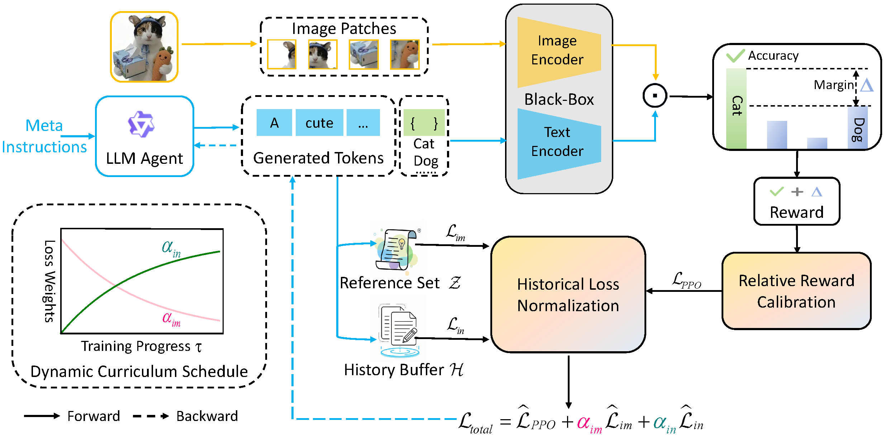

# Curriculum Reinforcement Learning for Black-Box Prompt Tuning via Large Language Models

> Official PyTorch Implementation of **Curriculum Reinforcement Learning for Black-Box Prompt Tuning via Large Language Models** 

---

## Table of Contents

1. [Abstract](#abstract)
3. [Setup](#setup)
4. [Data Preparation](#data-preparation)
5. [Running the Experiments](#running-the-experiments)
6. [Project Structure](#project-structure)

---

## Abstract

<p align="center">
  
</p>


> Black-box prompt tuning (BBPT) aims to optimize input prompts for large models where internal parameters and gradients are inaccessible. However, existing BBPT methods fail to simultaneously address the dual challenges of prompt interpretability and API overhead. To address these challenges, we propose CRL-BPT, a curriculum reinforcement learning framework that utilizes a Large Language Model (LLM) as an agent to generate human-readable prompts. Specifically, CRL-BPT implements a dynamic curriculum schedule on two auxiliary objectives: an imitation loss and an innovation loss.
> By dynamically weighting these objectives, CRL-BPT regularizes the RL process, guiding the agent's exploration from simple imitation of high-quality reference prompts to complex discovery of novel prompt patterns. Additionally, we introduce a historical loss normalization an adaptive relative reward scheme for stable training. Extensive experiments on 13 datasets demonstrate that CRL-BPT achieves state-of-the-art performance with significantly limited API calls.


---

## Setup

### Prerequisites

- Python 3.9+
- CUDA 11.7+ (recommended)
- ~24GB GPU memory (for LLM training with LoRA)


### Create and Activate Conda Environment

```bash
conda create -y -n bbpt python=3.9
conda activate bbpt
```

### Install PyTorch

> **Note:** Adjust the CUDA version according to your system. See [PyTorch official website](https://pytorch.org/).

```bash
pip install torch==2.4.0 torchvision==0.19.0 torchaudio==2.4.0 --index-url https://download.pytorch.org/whl/cu118
```

### Install Dependencies

```bash
pip install -r requirements.txt
```

### Key Dependencies

| Package | Version | Description |
|---------|---------|-------------|
| `torch` | 2.4.0 | Deep learning framework |
| `transformers` | 4.57.1 | Hugging Face Transformers |
| `trl` | 0.11.3 | Transformer Reinforcement Learning |
| `peft` | 0.17.1 | Parameter-Efficient Fine-Tuning (LoRA) |
| `clip` | - | OpenAI CLIP model |
| `dassl` | 0.6.3 | Domain Adaptation library |
| `wandb` | 0.22.3 | Experiment tracking |

### Install Dassl

Follow the instructions from [Dassl.pytorch](https://github.com/KaiyangZhou/Dassl.pytorch) to install the domain adaptation library.

---

## Data Preparation

### Dataset Setup

1. **Create Data Directory:**
   ```bash
   mkdir -p $DATA
   ```

2. **Download Datasets:**  
   Follow the instructions in [CoOp Dataset Guide](https://github.com/KaiyangZhou/CoOp/blob/main/DATASETS.md) to download and organize the datasets.

3. **Configure Data Path:**  
   Update the dataset configuration files in `datasets_config/` with your data path.

---

## Running the Experiments

### Few-Shot Learning

Run the training script with default parameters:

```bash
bash train.sh
```

Or run with custom parameters:

```bash
python stable_bbpt_curri_1.py \
    --clip_backbone ViT-B/16 \
    --batch_size 256 \
    --max_prompt_length 15 \
    --dataset oxford_pets \
    --num_human_examples 10 \
    --prompt_per_image 4 \
    --epochs 1000 \
    --max_num_apis 2000 \
    --num_shots 16 \
    --baseline_prompt "a photo of a {}." \
    --cv_ema_beta 0.99 \
    --cv_warmup_steps 5 \
    --cv_calibration_batches 200
```

### Key Arguments

| Argument | Default | Description |
|----------|---------|-------------|
| `--clip_backbone` | `ViT-B/16` | CLIP vision encoder backbone |
| `--batch_size` | `256` | Training batch size |
| `--max_prompt_length` | `15` | Maximum prompt token length |
| `--dataset` | `oxford_pets` | Target dataset name |
| `--num_shots` | `16` | Number of shots per class |
| `--prompt_per_image` | `4` | Number of prompts generated per batch |
| `--max_num_apis` | `2000` | Maximum CLIP API queries |
| `--baseline_prompt` | `"a photo of a {}."` | Baseline prompt for control variate |
| `--cv_ema_beta` | `0.99` | EMA decay for variance estimation |

### Multi-Dataset Evaluation

To run experiments on multiple datasets:

---

## Project Structure

```
CRL-BPT/
├── stable_bbpt_curri.py    # Main training script
├── utils_r.py                 # Utility functions & Control Variate
├── train.sh                   # Training shell script
├── requirements.txt           # Python dependencies
├── clip/                      # CLIP model implementation
│   ├── __init__.py
│   ├── clip.py
│   ├── model.py
│   └── simple_tokenizer.py
├── custom_datasets/           # Dataset loaders
│   ├── caltech101.py
│   ├── oxford_pets.py
│   ├── imagenet.py
│   └── ...
├── datasets_config/           # Dataset configurations
│   ├── caltech101.yaml
│   ├── oxford_pets.yaml
│   └── ...
├── prompt_examples/           # Reference prompts per dataset
│   ├── caltech101
│   ├── oxford_pets
│   └── ...
└── output/                    # Training outputs & best prompts
```

## 

---

## Acknowledgements

Our experimental pipeline is built upon the following repositories:

* [CoOp, CoCoOp](https://github.com/KaiyangZhou/CoOp) - Prompt learning for VLMs
* [TRL](https://github.com/huggingface/trl) - Transformer Reinforcement Learning
* [PEFT](https://github.com/huggingface/peft) - Parameter-Efficient Fine-Tuning
* [Dassl](https://github.com/KaiyangZhou/Dassl.pytorch) - Domain Adaptation library

For baseline comparisons, we referred to:

* [BlackVIP](https://github.com/changdaeoh/BlackVIP)
* [BPT-VLM](https://github.com/BruthYU/BPT-VLM)
* [ZIP](https://github.com/LOG-postech/ZIP)

We express our gratitude to all authors for sharing their outstanding work and making their contributions available through open-source initiatives.

---

## License

This project is released under the [MIT License](LICENSE).
